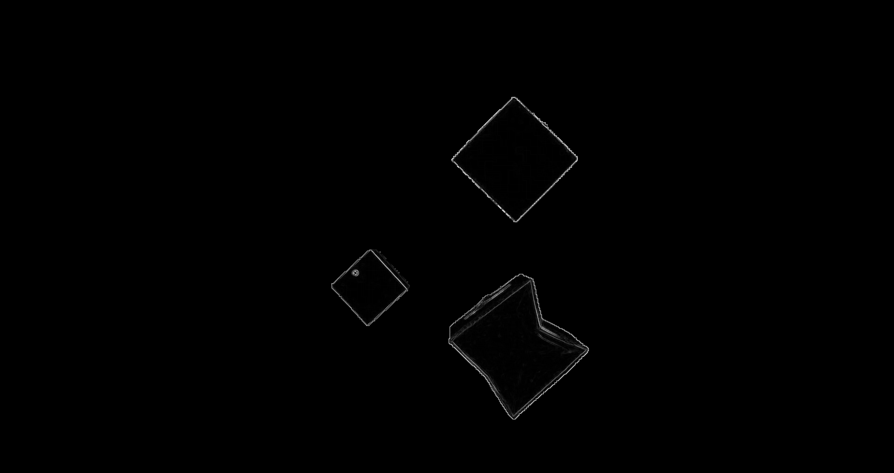

<h1 align="center">Background substraction & Sobel filter - Cuda</h1> 

TP1 en système industriel intelligent - Implémentation de la conversion RGB en HSV & Treshold & Filtre Sobel

<h1 align="center">Showcase</h1>

<h1 align="center">Green box on green background</h1>

<h1 align="center">Execution time</h1>

## By Pascal Canuel

